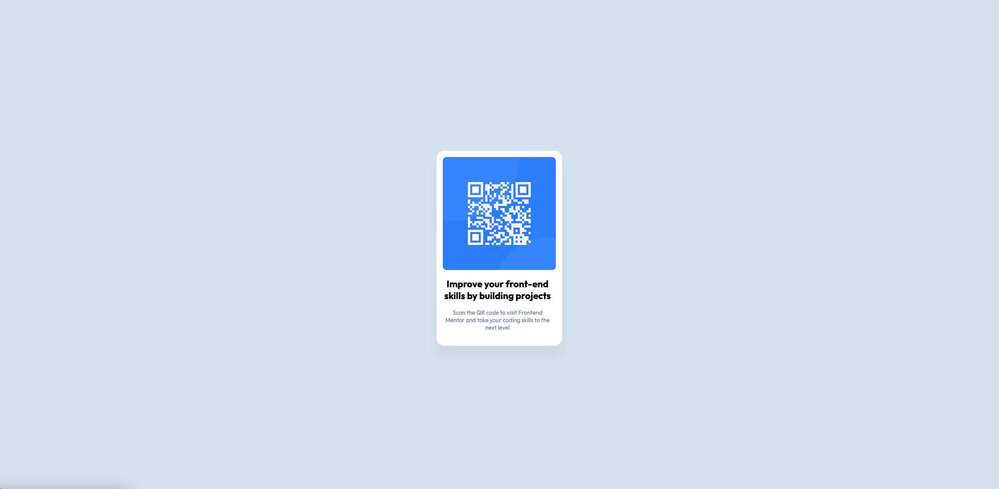

# Frontend Mentor - QR code component solution

This is a solution to the [QR code component challenge on Frontend Mentor](https://www.frontendmentor.io/challenges/qr-code-component-iux_sIO_H). Frontend Mentor challenges help you improve your coding skills by building realistic projects. 

## Table of contents

- [Overview](#overview)
  - [Screenshot](#screenshot)
  - [Links](#links)
- [My process](#my-process)
  - [Built with](#built-with)
  - [Continued development](#continued-development)
  - [Useful resources](#useful-resources)
- [Author](#author)

## Overview

### Screenshot

### Links

- Solution URL: [https://github.com/jstarr25/QR-Code](https://github.com/jstarr25/QR-Code)
- Live Site URL: [https://jstarr25.github.io/QR-Code/](https://jstarr25.github.io/QR-Code/)

## My process

### Built with

- Semantic HTML5 markup
- CSS custom properties

### Continued development

I found this challenge easier that I anticipated however I will continue to learn and grow in design.

### Useful resources

- [https://blog.devgenius.io/3-ways-to-center-a-div-with-css-3df9e66dbd42](https://blog.devgenius.io/3-ways-to-center-a-div-with-css-3df9e66dbd42) - This helped me center my layout as I struggled at first on centering my card.

## Author

- Frontend Mentor - [@jstarr25](https://www.frontendmentor.io/profile/jstarr25)
